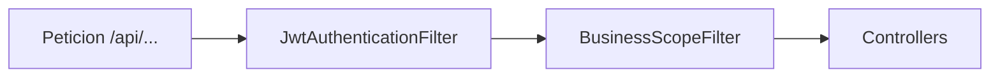

# Arquitectura del sistema

## Vista general

```
┌─────────────────────┐     HTTPS/HTTP      ┌──────────────────────────────┐
│  React SPA (Vite)   │ ◄───────────────►  │  Spring Boot REST API        │
│  localhost:5173     │   JSON + JWT       │  localhost:8080              │
│  Axios (client.ts)  │                    │  /api/*                      │
└─────────────────────┘                    └──────────────┬───────────────┘
                                                        │
                                                        │ JDBC
                                                        ▼
                                             ┌──────────────────┐
                                             │  PostgreSQL      │
                                             │  (dev: Docker)   │
                                             └──────────────────┘
```

- **Frontend**: React 19, React Router 7, Tailwind 4, componentes tipo shadcn en `frontend/src/components/ui/`.
- **Backend**: Spring Boot 3.x, Spring Security (JWT stateless), JPA/Hibernate, PostgreSQL.
- **Multi-tenant**: aislamiento por `businessId` en entidades y query param en la API; **validación de pertenencia** usuario ↔ negocio mediante `BusinessScopeFilter` + `BusinessAccessService` (ver [AUTH_AND_MULTITENANCY.md](./AUTH_AND_MULTITENANCY.md)).

## Cadena de seguridad HTTP (resumen)



- **`JwtAuthenticationFilter`**: valida JWT y rellena el `SecurityContext` con el `User`.
- **`BusinessScopeFilter`**: para rutas que no son `/api/auth/**` ni `/api/me/**`, exige `businessId` en query y comprueba que el usuario tenga rol en ese negocio.

## Capas del backend

| Capa | Ubicación típica | Responsabilidad |
|------|------------------|-----------------|
| HTTP | `controller/` | Endpoints REST, validación de entrada (`@Valid`) |
| Aplicación | `service/` | Reglas de negocio, transacciones |
| Persistencia | `repository/` | Spring Data JPA |
| Modelo | `model/` | Entidades JPA |
| Contratos | `dto/` | Records de request/response |
| Mapeo | `mapper/` | MapStruct entre entidad y DTO |

## Seguridad (resumen)

- Rutas públicas: `POST /api/auth/login`, `POST /api/auth/register`.
- El resto de `/api/**` exige cabecera `Authorization: Bearer <JWT>`.
- CORS configurable por `app.cors.allowed-origins` / `APP_CORS_ORIGINS`.

Detalle en [AUTH_AND_MULTITENANCY.md](./AUTH_AND_MULTITENANCY.md).

## Dominio funcional principal

1. **Autenticación**: registro e inicio de sesión; JWT almacenado en `localStorage` en el frontend.
2. **Negocio y usuarios**: modelo `User`, `Business`, `UserBusinessRole` (roles `OWNER`, `EMPLOYEE`). Datos demo solo en desarrollo: ver [SETUP_AND_RUN.md](./SETUP_AND_RUN.md).
3. **Catálogo**: `Product`, `Combo` y `ComboItem`.
4. **Clientes y direcciones**: `Customer`, `Address` (entrega).
5. **Pedidos**: `Order`, `OrderItem`; estados en `OrderStatus`; métodos de pago y entrega como enums.
6. **Turno de caja (CashShift)**: obligatorio para crear pedidos; el listado operativo de pedidos se asocia al turno abierto. Documentación extendida en los documentos `CASHSHIFT_*.md`.
7. **Gastos**: `Supplier`, `Supply`, `Expense`, `ExpenseItem` (categorías de insumo, totales calculados en servidor).

## Frontend: organización

- **Rutas**: definidas en `frontend/src/App.tsx` (área autenticada bajo `/dashboard/*`).
- **Estado global**: `AuthContext` (sesión), `BusinessContext` (negocio actual desde `GET /api/me/businesses`).
- **Datos**: hooks (`useOrders`, `useProducts`, etc.) y servicios que llaman al `api/client` Axios.

## Persistencia y esquema

- En desarrollo, `spring.jpa.hibernate.ddl-auto: update` en `application.yaml` sincroniza el esquema con las entidades.
- En producción (`application-prod.yaml`), `validate`: el esquema debe coincidir con las entidades (sin auto-ALTER).

## Referencias cruzadas

- API: [API_REFERENCE.md](./API_REFERENCE.md)
- Entidades: [DOMAIN_MODEL.md](./DOMAIN_MODEL.md)
- Puesta en marcha: [SETUP_AND_RUN.md](./SETUP_AND_RUN.md)
